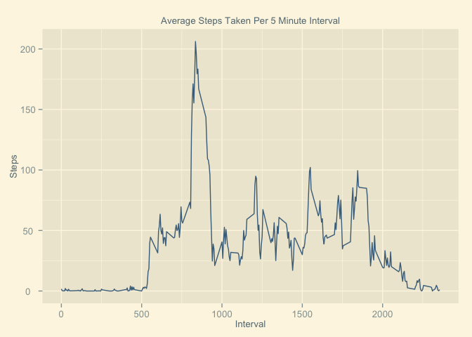

Samuel Sherman
March 2015
Reproducible Research: Peer Assesment 1
======================================== 

## Loading and preprocessing the data

```{r echo = TRUE}
#Load appropriate packages for data processing and plotting
library(dplyr)
library(ggplot2)
library(ggthemes)
unzip("activity.zip") #Unzip data
activity.data <- read.csv("activity.csv") #Read data file
```

## What is the mean total number of steps taken per day?

1. Calculate the totatle number of steps taken per day

```{r echo = TRUE}
steps.day <- aggregate(steps ~ date, activity.data, sum) #Sum steps by date
steps.day$date <- strptime(steps.day$date, 
                           format = "%Y-%m-%d") #Change date to date class
```

2. Make a histogram of the total number of steps taken per day

```{r echo = TRUE}
plot <- ggplot(steps.day, aes(date, steps)) +
        geom_histogram(stat = "identity", fill = "skyblue4") +  
        theme_solarized_2() +
        theme(text = element_text(size = 10)) + #Fix overlapping numbers
        ggtitle(expression("Total Steps Taken Per Day")) +
        xlab("Date") +
        ylab("Steps")
ggsave("./figure/steps_per_day.png", dpi = 125)
```


2. Calculate and report the mean and median total number of steps taken per day

```{r echo = TRUE}
avg.steps.day <- mean(steps.day$steps)
med.steps.day <- median(steps.day$steps)
```

Mean:
```{r echo = FALSE}
 print(avg.steps.day)
```

Median:
```{r echo = FALSE}
 print(med.steps.day)
```

## What is the average daily activity pattern?

1. Make a time series plot (i.e. `type = "l"`) of the 5-minute
   interval (x-axis) and the average number of steps taken, averaged
   across all days (y-axis)

```{r echo = TRUE}
steps.interval <- aggregate(steps ~ interval, activity.data, mean)
plot <- ggplot(steps.interval, aes(interval, steps)) +
        geom_line(stat = "identity", colour = "skyblue4") +  
        theme_solarized_2() +
        theme(text = element_text(size = 10)) + #fix overlapping numbers
        ggtitle(expression("Average Steps Taken Per 5 Minute Interval")) +
        xlab("Interval") +
        ylab("Steps")
ggsave("./figure/steps_per_5min.png", dpi = 125)
```



2. Which 5-minute interval, on average across all the days in the
   dataset, contains the maximum number of steps?

```{r echo = TRUE}
steps.interval$interval[which.max(steps.interval$steps)]
```

```{r echo = FALSE}
steps.interval$interval[which.max(steps.interval$steps)]
```

## Imputing missing values

1. Calculate and report the total number of missing values in the
   dataset (i.e. the total number of rows with `NA`s)

```{r echo = TRUE}
sum(is.na(activity.data))
```

Total number of missing values:
```{r echo = FALSE}
sum(is.na(activity.data))
```

2. Devise a strategy for filling in all of the missing values in the
   dataset. The strategy does not need to be sophisticated. For
   example, you could use the mean/median for that day, or the mean
   for that 5-minute interval, etc.

I believe the best strategy for filling the missing values would be to use the
average steps taken accross all days for each interval.  Therefore, I will
merge the original activity data with the data that shows the average steps per
interval for each day.  Then replace each na value withe the appropriate
average.   

3. Create a new dataset that is equal to the original dataset but with
   the missing data filled in.

```{r echo = TRUE}
activity.data2 <- merge(activity.data, steps.interval, 
                       by = "interval", suffixes = c("", "avg"))
na.values <- is.na(activity.data2$steps)
activity.data2$steps[na.values] <- activity.data2$stepsavg[na.values]
activity.data2 <- activity.data2[, 1:3]
activity.data2 <- arrange(activity.data2, date)
```

4. Make a histogram of the total number of steps taken each day and
   calculate and report the mean and median total number of
   steps taken per day. Do these values differ from the estimates from
   the first part of the assignment? What is the impact of imputing
   missing data on the estimates of the total daily number of steps?

```{r echo = TRUE}
steps.day2 <- aggregate(steps ~ date, activity.data2, sum) #Sum steps by date
steps.day2$date <- strptime(steps.day2$date, 
                           format = "%Y-%m-%d") #Change date to date class
```

```{r echo = TRUE}
plot <- ggplot(steps.day2, aes(date, steps)) +
        geom_histogram(stat = "identity", fill = "skyblue4") +  
        theme_solarized_2() +
        theme(text = element_text(size = 10)) + #Fix overlapping numbers
        ggtitle(expression("Total Steps Taken Per Day")) +
        xlab("Date") +
        ylab("Steps")
ggsave("figure/steps_per_day2.png", dpi = 125)
```


The impact of the missing data seems rather low, at least when
estimating the total number of steps per day.

## Are there differences in activity patterns between weekdays and weekends?

1. Create a new factor variable in the dataset with two levels --
   "weekday" and "weekend" indicating whether a given date is a
   weekday or weekend day.

```{r, cache=TRUE}
days <- function(date) {
    if (weekdays(as.Date(date)) %in% c("Saturday", "Sunday")) {
        "weekend"
    } else {
        "weekday"
    }
}
activity$daytype <- as.factor(sapply(activity$date, daytype))
```

2. Make a panel plot containing a time series plot (i.e. `type = "l"`)
   of the 5-minute interval (x-axis) and the average number of steps
   taken, averaged across all weekday days or weekend days
   (y-axis).

```{r}
par(mfrow=c(2,1))
for (type in c("weekend", "weekday")) {
    steps.type <- aggregate(steps ~ interval,
                            data=activity,
                            subset=activity$daytype==type,
                            FUN=mean)
    plot(steps.type, type="l", main=type)
}
```