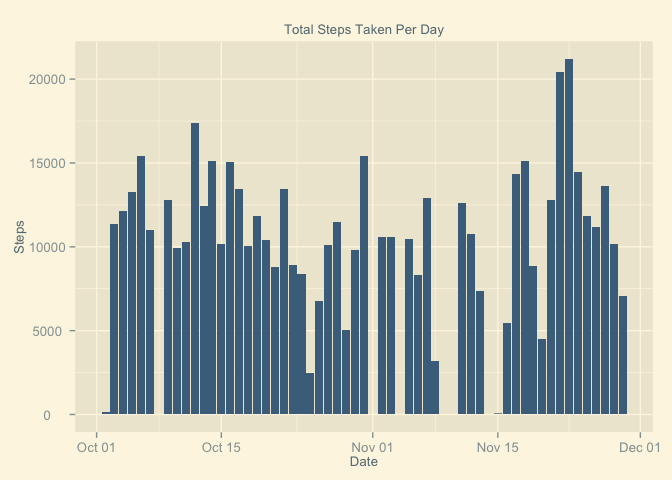
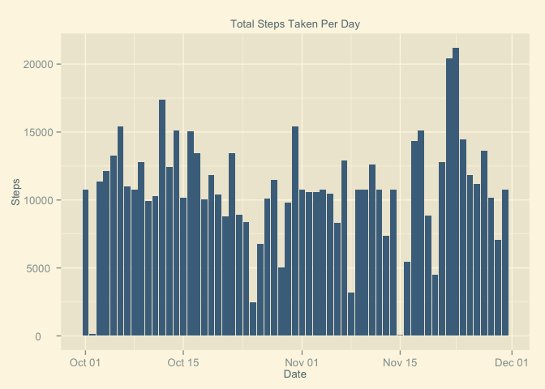

# Reproducible Research: Peer Assessment 1

##Samuel Sherman
##March 2015


### Loading and preprocessing the data


```r
#Load appropriate packages for data processing and plotting
suppressPackageStartupMessages(require(dplyr))
suppressPackageStartupMessages(require(plyr))
library(ggplot2)
library(ggthemes)
options(scipen = 6) #Reduce probability of scientific notation
unzip("activity.zip") #Unzip data
activity.data <- read.csv("activity.csv") #Read data file
```

### What is the mean total number of steps taken per day?

* __Calculate the total number of steps taken per day__


```r
steps.day <- aggregate(steps ~ date, activity.data, sum) #Sum steps by date
steps.day$date <- strptime(steps.day$date, 
                           format = "%Y-%m-%d") #Change date to date class
```

* __Make a histogram of the total number of steps taken per day__


```r
plot <- ggplot(steps.day, aes(date, steps)) +
        geom_histogram(stat = "identity", fill = "skyblue4") +  
        theme_solarized_2() +
        theme(text = element_text(size = 10)) + #Fix overlapping numbers
        ggtitle(expression("Total Steps Taken Per Day")) +
        xlab("Date") +
        ylab("Steps")
ggsave("./figure/steps_per_day.png", dpi = 125)
```



* __Calculate and report the mean and median total number of steps taken per day__


```r
mean.stpsdy <- mean(steps.day$steps)
median.stpsdy <- median(steps.day$steps)
print(mean.stpsdy)
```

```
## [1] 10766.19
```

```r
print(median.stpsdy)
```

```
## [1] 10765
```

_The mean number of steps per day is 10766.19 and the median
number of steps per day is 10765._

### What is the average daily activity pattern?

*  __Make a time series plot (i.e. `type = "l"`) of the 5-minute
   interval (x-axis) and the average number of steps taken, averaged
   across all days (y-axis)__


```r
steps.interval <- aggregate(steps ~ interval, activity.data, mean)
plot <- ggplot(steps.interval, aes(interval, steps)) +
        geom_line(stat = "identity", colour = "skyblue4") +  
        theme_solarized_2() +
        theme(text = element_text(size = 10)) + #Fix overlapping numbers
        ggtitle(expression("Average Steps Taken Per 5 Minute Interval")) +
        xlab("Interval") +
        ylab("Steps")
ggsave("./figure/steps_per_5min.png", dpi = 125)
```


*  __Which 5-minute interval, on average across all the days in the
   dataset, contains the maximum number of steps?__


```r
interval <- steps.interval$interval[which.max(steps.interval$steps)]
print(interval)
```

```
## [1] 835
```

_Interval 835 contains the maximum number of steps, on average._

### Imputing missing values

*  __Calculate and report the total number of missing values in the
   dataset (i.e. the total number of rows with `NA`s)__
   

```r
sum.na <- sum(is.na(activity.data))
print(sum.na)
```

```
## [1] 2304
```

_The total number of missing values within the dataset is 2304._

*  __Devise a strategy for filling in all of the missing values in the
   dataset. The strategy does not need to be sophisticated. For
   example, you could use the mean/median for that day, or the mean
   for that 5-minute interval, etc.__

_I believe the best strategy for filling the missing values is to use the
average steps taken accross all days for each interval.  Therefore, I will
merge the original activity data with the data that shows the average steps per
interval for each day.  Then replace each na value with the appropriate
average._   

*  __Create a new dataset that is equal to the original dataset but with
   the missing data filled in.__


```r
#Merge original data with the steps.interval data
activity.data2 <- merge(activity.data, steps.interval, 
                       by = "interval", suffixes = c("", "avg"))
#Logic vector for na values in new dataset
na.values <- is.na(activity.data2$steps)
activity.data2$steps[na.values] <- activity.data2$stepsavg[na.values]
activity.data2 <- activity.data2[, 1:3]
activity.data2 <- arrange(activity.data2, date)
```

*  __Make a histogram of the total number of steps taken each day and
   calculate and report the mean and median total number of
   steps taken per day. Do these values differ from the estimates from
   the first part of the assignment? What is the impact of inputing
   missing data on the estimates of the total daily number of steps?__


```r
steps.day2 <- aggregate(steps ~ date, activity.data2, sum) #Sum steps by date
steps.day2$date <- strptime(steps.day2$date, 
                           format = "%Y-%m-%d") #Change date to date class
```


```r
plot <- ggplot(steps.day2, aes(date, steps)) +
        geom_histogram(stat = "identity", fill = "skyblue4") +  
        theme_solarized_2() +
        theme(text = element_text(size = 10)) + #Fix overlapping numbers
        ggtitle(expression("Total Steps Taken Per Day")) +
        xlab("Date") +
        ylab("Steps")
ggsave("figure/steps_per_day2.png", dpi = 125)
```




```r
mean.stpsdy2 <- mean(steps.day2$steps)
median.stpsdy2 <- median(steps.day2$steps)
print(mean.stpsdy2)
```

```
## [1] 10766.19
```

```r
print(median.stpsdy2)
```

```
## [1] 10766.19
```

_The mean number of steps per day is 10766.19 and the median
number of steps per day is 10766.19._

_Adding the average steps per interval in replacement of the NA values helped
fill out the original graph, providing a more even distribution. There are a
less outliers. The mean and median values are now exaclty the same, as before
they were a step in difference._ 

### Are there differences in activity patterns between weekdays and weekends?

*  __Create a new factor variable in the dataset with two levels --
   "weekday" and "weekend" indicating whether a given date is a
   weekday or weekend day.__


```r
#Weekdays function to define the day of week for each date
dayofwk <- weekdays(as.Date(activity.data2$date))
#Add column to define day of week
activity.weekdays <- transform(activity.data2, Day = dayofwk)
#Add column to define week type
wend <- c("Saturday", "Sunday")
activity.weekdays$weektype <- ifelse(activity.weekdays$Day %in% wend, 
                                     "Weekend", "Weekday")
#Change order for facet_grid
w <- factor(activity.weekdays$weektype, levels = c("Weekend","Weekday"))
activity.weekdays <- transform(activity.weekdays, weektype = w)
```

*  __Make a panel plot containing a time series plot (i.e. `type = "l"`)
   of the 5-minute interval (x-axis) and the average number of steps
   taken, averaged across all weekday days or weekend days
   (y-axis).__


```r
#Mean of steps for each interval of each weektype
steps.interval2 <- aggregate(steps ~ interval + weektype,  
                             activity.weekdays, mean)
#Time series panel plot separted by weektype
plot <- ggplot(steps.interval2, aes(interval, steps)) +
        geom_line(stat = "identity", colour = "skyblue4") + 
        facet_grid(weektype ~ .) + #Separate graphs by weektype
        theme_solarized_2() +
        theme(text = element_text(size = 10)) + #Fix overlapping numbers
        ggtitle(expression("Average Steps Taken Per 5 Minute Interval")) +
        xlab("Interval") +
        ylab("Steps")
ggsave("./figure/steps_per_5min2.png", dpi = 125)
```


